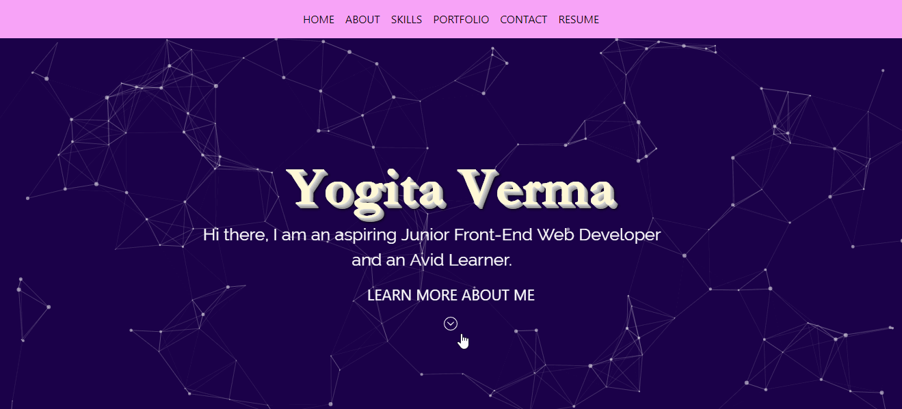
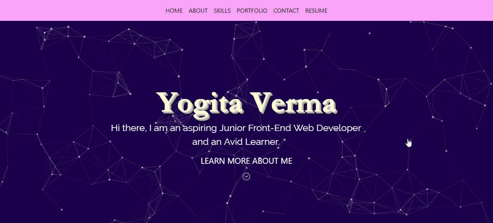
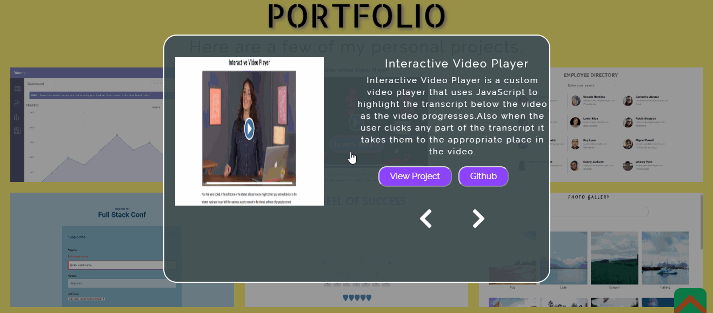
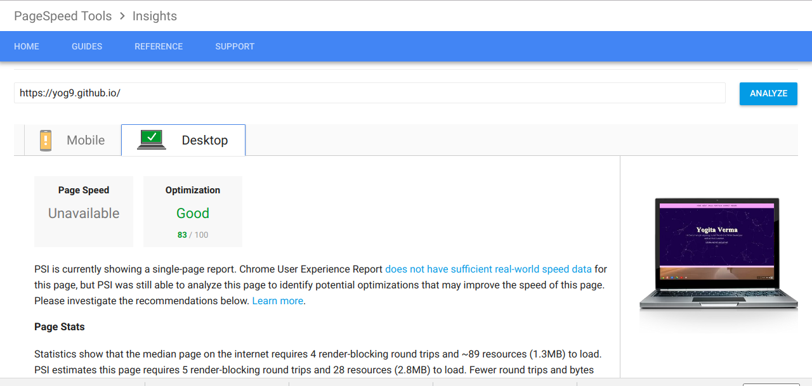

# Yogita Verma

## Front-End Developer Portfolio

### Summary
My full front-end portfolio with web development skills, examples of my projects, contact links, and a bit about me .

### Getting Started
Click the demo link or clone/download the repository on your local machine and open it with a live server to see the use of particle.js.
  

### Built With
* Bootstrap 4
* CSS3
* jQuery
* Particle.js library

### Features
**1. Responsive Design**

**2. A single page design with discrete sections**

**3. Simple, elegant design with functionality and usability as the top concern**

**4. jQuery smooth scrolling: clicking on a menu item takes you to the section in a smooth scrolling movement**

**5. Clicking the learn more button in Portfolio Section opens a modal with project description the projects can be navigated through left and right arrows and can be closed by clicking outside the modal or by pressing ESC**

**6. Increased the pagespeed insights for desktops to 83%.**

### Coming Soon
- [ ] Recreating the portfolio with react.
